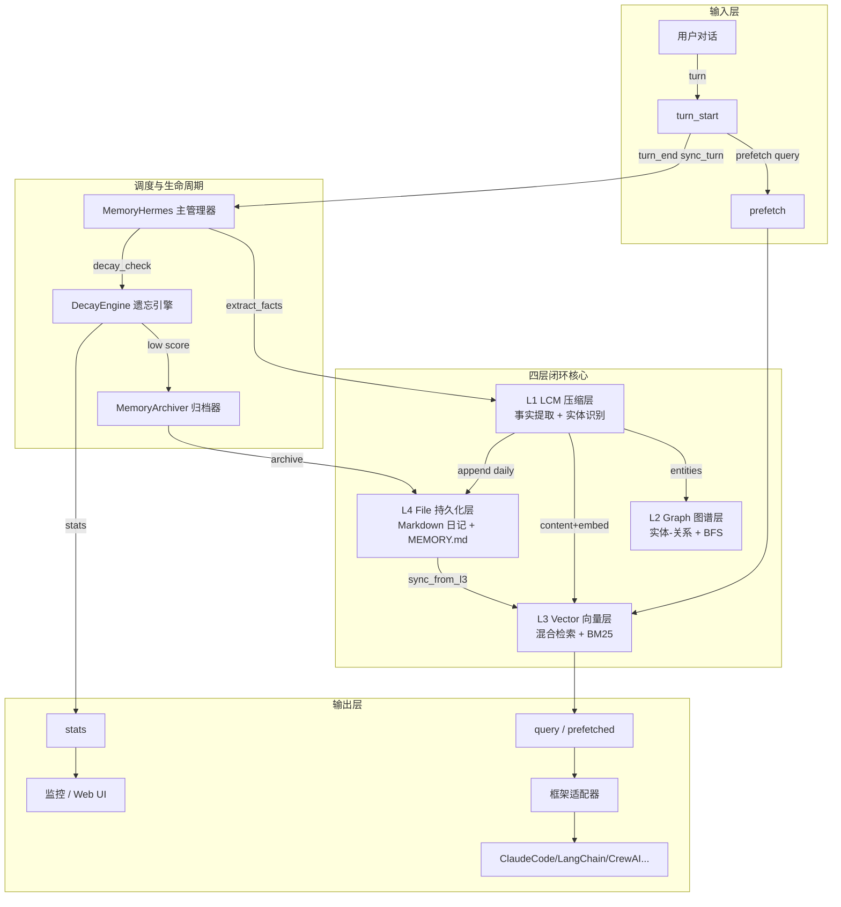
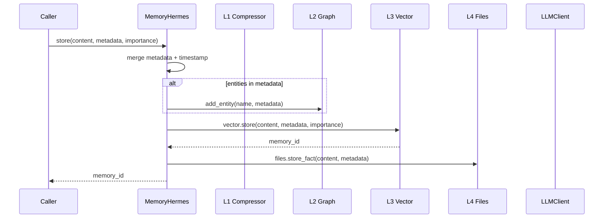
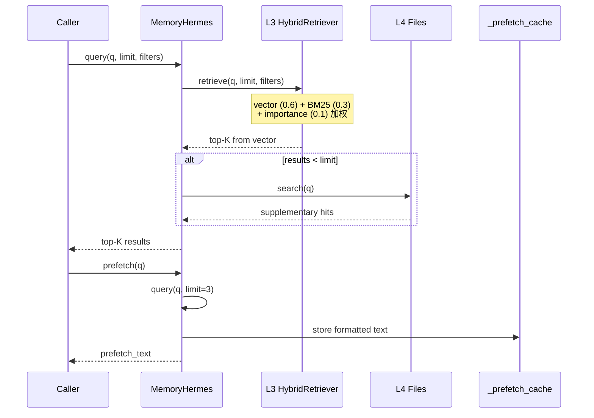
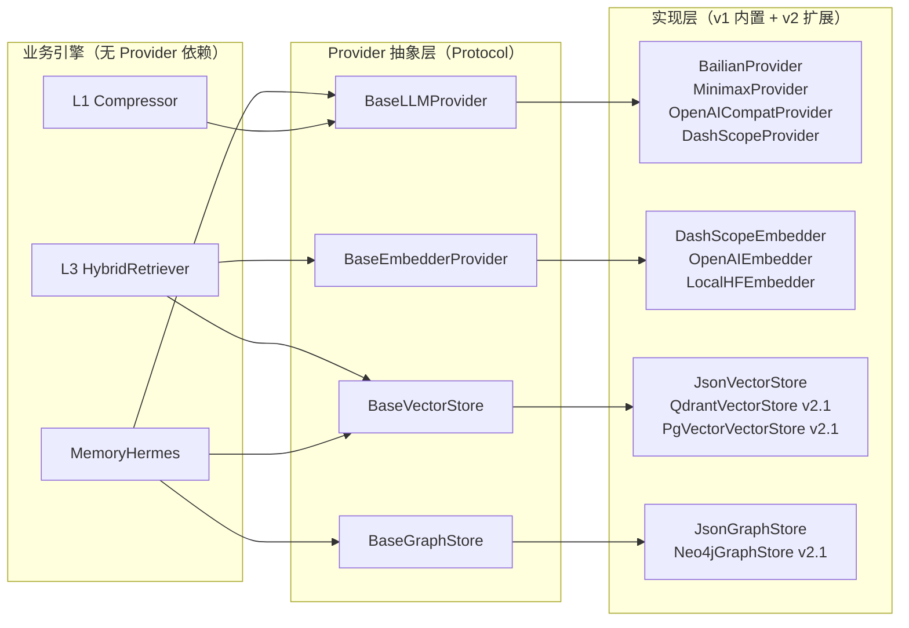
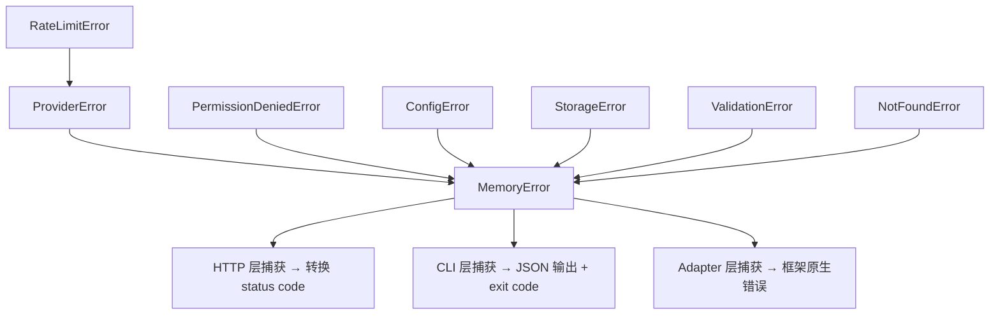
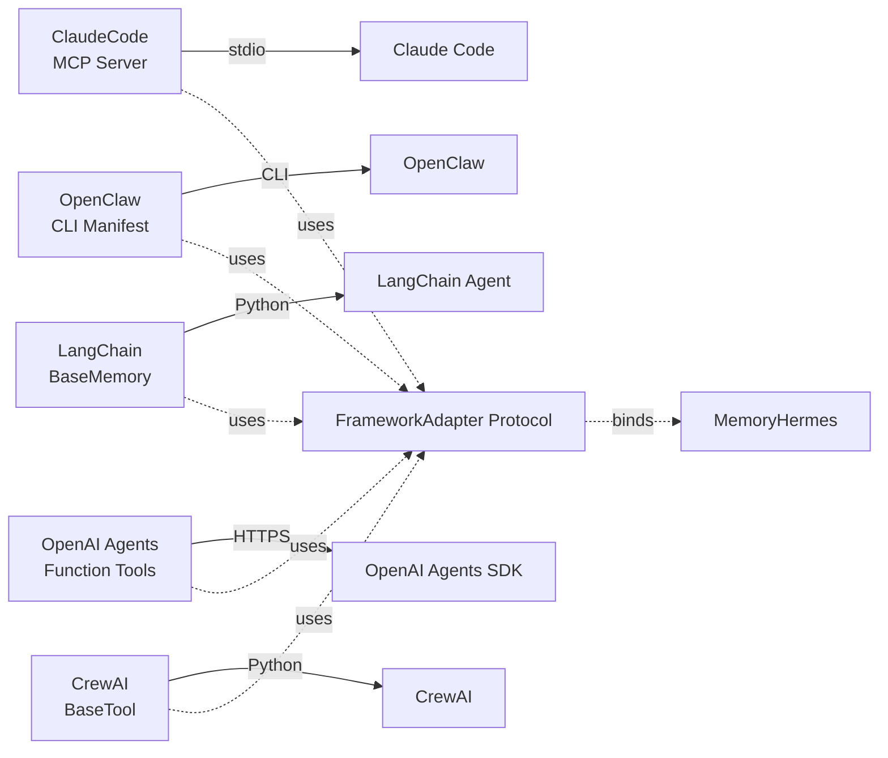
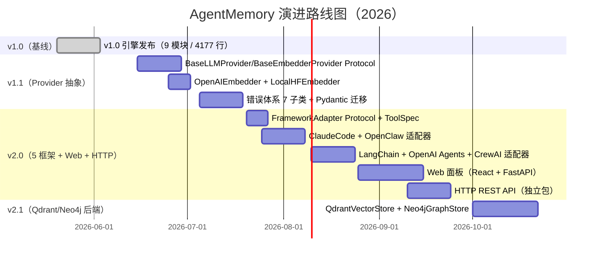

# AgentMemory v2.0 架构设计文档 ⚠️ 已废弃

> **⚠️ 已废弃 - 请参考最新文档**
> - 当前版本：`ARCHITECTURE-v0.3.md` 或 `docs/ARCHITECTURE-IMPL.md`
> - v2.0 描述的四层架构（L1/L2/L3/L4）已被 v0.3 双轨+图书馆架构替代
> - L2 Graph-DB 从未实现，已删除

---

# AgentMemory v2.0 架构设计文档（历史版本）

> **作者**：架构师（architect）
> **任务 ID**：`ae1abe36-72d7-4e56-8d97-01d5bf8141be`
> **版本**：v2.0.0
> **日期**：2026-06-04
> **基础**：v1.0.0 引擎（4177 行 Python · 2 commit · 9 模块） + 调研报告 `docs/investigation-report.md`（725 行）
> **目标读者**：团队 6 名成员（architect / backend × 2 / frontend / qa × 2）+ 后续接手工程师

---

## 0. 阅读路径

| 角色 | 推荐阅读章节 |
|------|------|
| 架构师 | 全文 |
| 后端工程师 | §2 / §3 / §4 / §5 / §6 / §7 / §10 |
| 前端工程师 | §5（适配器契约）/ §8（Web 适配器） |
| 测试工程师 | §6（错误体系）/ §7（数据契约）/ §10（演进路线图） |
| 新人 | §1 → §2 → §3 → §10 |

---

## 1. 项目愿景与定位

**AgentMemory v2.0** 是一套**通用、便携、可插拔的 Agent 长期记忆插件**，围绕 5 个核心维度构建：

- **易用**（Usability）：1 行 `pip install`、1 行 `from agentmemory import MemoryHermes`、1 套 `Config.get("a.b.c")` 点分路径配置
- **可移植**（Portability）：纯 Python 3.10+、核心仅 2 个依赖（httpx + aiofiles）、跨 Win/macOS/Linux
- **强大**（Power）：4 层闭环（L1 压缩 / L2 图谱 / L3 向量 / L4 文件）+ 混合检索（向量 + BM25 + 重要性）+ 半衰期遗忘引擎
- **易修改**（Modifiability）：Provider 完全抽象（LLM / Embedder / VectorStore / GraphStore）、Protocol 接口契约、配置驱动
- **适配**（Adaptability）：覆盖 5 个 Agent 框架（ClaudeCode / OpenClaw / LangChain / OpenAI Agents / CrewAI）+ HTTP REST API + MCP Server + Web 面板

**一句话定位**：让任何 Agent 框架在 **5 分钟内**接上一套工业级长期记忆，且**不被锁定**到任何特定 LLM/Embedder/向量库。

---

## 2. 四层闭环架构（核心差异化设计）

### 2.1 数据流总览



### 2.2 各层职责

| 层 | 模块 | 行数 | 职责 | 关键类 / 函数 |
|------|------|------|------|------|
| L1 压缩 | `L1_lcm_compressor.py` | 584 | 对话 → 结构化事实 + 实体识别 | `LCMCompressor`、`FactExtractor`、`FactType`(8 种) |
| L2 图谱 | `L2_graph_store.py` | 380 | 实体-关系存储 + 邻居查询 + 最短路径 BFS | `GraphStore`、`Entity`/`Relation`、`EntityType`/`RelationType` |
| L3 向量 | `L3_vector_store.py` | 730 | 混合检索（向量 + BM25 + 重要性）+ JSON 持久化 | `VectorStore`、`BM25Indexer`、`HybridRetriever`、`MemoryEntry` |
| L4 文件 | `L4_file_persist.py` | 861 | Markdown 日记 + MEMORY.md 长期记忆 + 归档 | `DailyMemory`、`MemoryMD`、`FilePersistStore`、`MemoryCategory` |
| 引擎 | `decay_engine.py` | 491 | 半衰期衰减 + 三维评分 + 遗忘/归档决策 | `DecayEngine`、`MemoryArchiver`、`DecayScore` |
| LLM | `llm_client.py` | 358 | 4 个 Provider 适配（minimax / bailian / openai / dashscope）| `LLMClient`、`LLMResponse` |
| 主控 | `memory_manager.py` | 466 | 生命周期管理 + 9 个公开异步 API | `MemoryHermes` |
| 配置 | `config.py` | 91 | 点分路径配置 + 路径解析 | `Config`、`get_config()` |
| CLI | `cli.py` | 206 | 11 个 argparse 子命令 | `main()` |

### 2.3 写入路径（store）



### 2.4 读取路径（query / prefetch）



### 2.5 v1.0 已知缺陷（v2.0 修复目标）

| 缺陷 | 触发条件 | 修复方向 | 任务编号 |
|------|------|------|------|
| `L3_vector_store._save()` 同步写死锁 | fixture 大量并发 store | 改为 async + queue + 写盘 worker | T3 |
| L2 `get_neighbors` 签名不一致 | 期望返回 `(entities, relations)` tuple | 扩展返回类型为 `NeighborsResult` dataclass | T5 |
| CLI `from cli import cli` 不存在 | 测试假设 click 框架 | 保留 argparse + 提供 `cli` 别名 | T5 |
| `MemoryArchiver.archive_to_deep_storage` 签名 | 测试假设双参数 | 明确 `archive(memory_id, snapshot)` 签名 | T5 |

---

## 3. 公开 API 速查表

### 3.1 `MemoryHermes` 10 个方法

```python
from agentmemory import MemoryHermes  # v2.0 路径（v1.0: from src import MemoryHermes）

mh = MemoryHermes(config_path=None)  # config_path: 可选 JSON 路径

# 写入
await mh.store(content: str, metadata: dict = None, importance: float = 0.5) -> str
#   返回 memory_id (ULID)

# 读取
await mh.query(query: str, limit: int = 5, filters: dict = None) -> list[dict]
#   返回 [{id, content, score, metadata, layer}, ...]
await mh.prefetch(query: str) -> str
#   返回格式化的预取文本（同时写入 _prefetch_cache）
mh.get_prefetched(query: str = None) -> str
#   同步获取缓存

# 遗忘
await mh.forget(memory_id: str, permanent: bool = False) -> bool
#   permanent=True 直接删除；False 归档到 deep_storage

# 生命周期
await mh.sync_turn(user_message: str, assistant_message: str) -> list[dict]
#   提取事实并写入，返回 [{id, content, fact_type}, ...]
await mh.on_session_end(summary: str = None) -> dict
#   写入 session summary + 触发 decay_check，返回 {stored, archived, stats}

# 维护
await mh.run_decay_check() -> dict
#   返回 {forgotten: int, archived: int, remaining: int}

# 兼容接口
await mh.execute(action: str, params: dict = None) -> dict
#   action ∈ {store, query, prefetch, forget, get_stats, session_end, sync_turn}

# 监控
mh.get_stats() -> dict
#   同步统计：{total, by_layer, decay_threshold, archive_count}
```

### 3.2 `Config` 6 个核心字段

```python
from agentmemory import Config, get_config

cfg = get_config()  # 单例
# 或
cfg = Config(config_path="path/to/user_config.json")

# 6 个核心字段（DEFAULT_CONFIG 顶层）
cfg.get("embedding.provider")        # "dashscope" | "openai" | "bailian" | "minimax"
cfg.get("embedding.model")           # 默认 "text-embedding-v3"
cfg.get("embedding.dimensions")      # 默认 1024
cfg.get("llm.provider")              # 默认 "bailian"
cfg.get("llm.model")                 # 默认 "qwen3.6-plus"
cfg.get("decay.half_life_days")      # 默认 14.0

# 点分路径示例
cfg.get("hybrid_search.vector_weight")  # 0.6
cfg.get("layers.l3_vector")             # True
cfg.get_storage_path("vectors.json")    # 绝对路径
cfg.get_api_key("BAILIAN_API_KEY")      # 从环境变量读取
```

完整 `DEFAULT_CONFIG` 见 `src/config.py` 8-44 行。

### 3.3 v1.0 → v2.0 API 变更

| 变更 | v1.0 | v2.0 | 兼容性 |
|------|------|------|------|
| 包名 | `from src import MemoryHermes` | `from agentmemory import MemoryHermes` | v1.0 路径继续支持到 v2.1 |
| 返回类型 | `MemoryEntry` / `Entity` 对象 | 统一为 `dict`（含 `id`/`content`/`score`） | 字段兼容 |
| `query` filters | `dict` 自由格式 | 强制 `Filters` Pydantic model（7 比较操作符） | 严格化，向后兼容 `None` |
| `forget` 行为 | 默认归档 | 默认软删（importance=0） | **破坏** — 需用 `permanent=False` 保留旧行为 |
| `execute` action 集 | 6 个 | 7 个（新增 `decay_check`） | 向后兼容 |

---

## 4. Provider 抽象契约

### 4.1 设计原则

- **零硬依赖**：v2.0 核心不依赖任何 LLM/Embedder SDK，所有 Provider 通过 Protocol 注入
- **向后兼容**：v1.0 的 `LLMClient` 实现保留为 `BailianProvider`（默认）+ `MinimaxProvider` + `OpenAICompatProvider` + `DashScopeProvider`
- **可插拔**：用户可通过 `cfg.providers.<role> = "my_module.MyProvider"` 自定义

### 4.2 `BaseLLMProvider` 契约（v1 接口）

```python
from typing import Protocol, runtime_checkable
from dataclasses import dataclass

@dataclass(frozen=True)
class LLMMessage:
    role: str  # "system" | "user" | "assistant"
    content: str

@dataclass(frozen=True)
class LLMResponse:
    content: str
    model: str
    usage: dict  # {"prompt_tokens": int, "completion_tokens": int, "total_tokens": int}
    raw: dict = None  # provider 原始响应（debug 用）

@runtime_checkable
class BaseLLMProvider(Protocol):
    """v1 契约：所有 LLM Provider 必须实现 chat / stream 两个方法"""

    name: str  # Provider 标识，如 "openai" / "bailian"

    async def chat(
        self,
        messages: list[LLMMessage],
        *,
        model: str = None,
        temperature: float = 0.7,
        max_tokens: int = 2048,
        json_mode: bool = False,
        **kwargs,
    ) -> LLMResponse:
        """同步对话（必须实现）"""
        ...

    async def stream(
        self,
        messages: list[LLMMessage],
        *,
        model: str = None,
        temperature: float = 0.7,
        max_tokens: int = 2048,
        **kwargs,
    ):
        """流式对话（可选；不实现时 chat 自动降级为整段返回）"""
        ...

    async def health_check(self) -> bool:
        """健康检查（用于监控 + adapter 启动验证）"""
        ...
```

### 4.3 `BaseEmbedderProvider` 契约（v1 接口）

```python
from typing import Protocol, runtime_checkable

@runtime_checkable
class BaseEmbedderProvider(Protocol):
    """v1 契约：所有 Embedder Provider 必须实现 embed / embed_batch"""

    name: str  # Provider 标识
    dimensions: int  # 输出维度（用于索引一致性检查）

    async def embed(self, text: str) -> list[float]:
        """单条文本向量化（必须实现）"""
        ...

    async def embed_batch(self, texts: list[str]) -> list[list[float]]:
        """批量向量化（必须实现，批量可走 API 批处理）"""
        ...

    async def health_check(self) -> bool:
        ...

    def cosine_similarity(self, a: list[float], b: list[float]) -> float:
        """默认实现可用；Provider 可覆盖以利用 GPU"""
        ...
```

### 4.4 `BaseVectorStore` / `BaseGraphStore` 契约（v2 引入）

```python
from typing import Protocol, runtime_checkable

@runtime_checkable
class BaseVectorStore(Protocol):
    """v2 契约：v1.0 自实现 JSON 升为此协议的默认实现"""

    name: str

    async def upsert(self, id: str, vector: list[float], payload: dict) -> None: ...
    async def search(self, vector: list[float], top_k: int = 5, filters: dict = None) -> list[dict]: ...
    async def delete(self, id: str) -> bool: ...
    async def update(self, id: str, payload: dict) -> bool: ...
    async def count(self) -> int: ...

@runtime_checkable
class BaseGraphStore(Protocol):
    """v2 契约：v1.0 GraphStore 升为 JsonGraphStore"""

    name: str

    async def add_entity(self, name: str, type: str, attrs: dict) -> None: ...
    async def add_relation(self, src: str, rel: str, dst: str, attrs: dict) -> None: ...
    async def get_neighbors(self, name: str, depth: int = 1) -> dict: ...
    async def find_path(self, src: str, dst: str) -> list[str]: ...
    async def search(self, query: str, limit: int = 5) -> list[dict]: ...
```

### 4.5 Provider 分层架构



### 4.6 Provider 配置示例（`config.json`）

```json
{
  "providers": {
    "llm": {
      "module": "agentmemory.providers.bailian",
      "class": "BailianProvider",
      "config": {
        "api_key_env": "BAILIAN_API_KEY",
        "base_url": "https://token-plan.cn-beijing.maas.aliyuncs.com/compatible-mode/v1",
        "model": "qwen3.6-plus"
      }
    },
    "embedder": {
      "module": "agentmemory.providers.dashscope_embedder",
      "class": "DashScopeEmbedder",
      "config": {
        "api_key_env": "DASHSCOPE_API_KEY",
        "model": "text-embedding-v3",
        "dimensions": 1024
      }
    },
    "vector_store": {
      "module": "agentmemory.vector.json_store",
      "class": "JsonVectorStore"
    },
    "graph_store": {
      "module": "agentmemory.graph.json_store",
      "class": "JsonGraphStore"
    }
  }
}
```

---

## 5. Framework Adapter 契约

### 5.1 设计动机

v1.0 仅提供 `execute()` 通用接口作为 AgentSymphony 兼容层，但缺乏：
- 框架原生的 tool 导出格式（Claude Code MCP / LangChain Tool / OpenAI function calling）
- 类型安全的工具描述（parameter schema）
- 风险分级（read / write / destructive）

v2.0 引入标准 `FrameworkAdapter` 协议，让**任何新框架的接入只需实现 3 个方法**。

### 5.2 `ToolSpec` 数据类

```python
from dataclasses import dataclass, field
from typing import Literal

@dataclass(frozen=True)
class ToolParam:
    """工具参数描述（OpenAI function calling / MCP 兼容）"""
    name: str
    type: Literal["string", "integer", "number", "boolean", "array", "object"]
    description: str
    required: bool = True
    enum: list = None
    default: object = None
    items: dict = None  # for array type

@dataclass(frozen=True)
class ToolSpec:
    """
    工具规格 — 框架无关的中间表示
    
    所有 framework 适配器必须将 MemoryHermes 操作翻译为 ToolSpec 列表，
    再由各适配器转成目标格式（MCP / LangChain / OpenAI / CrewAI）。
    """
    name: str  # 必须以 "memory_" 开头
    description: str
    parameters: list[ToolParam] = field(default_factory=list)
    risk_level: Literal["read", "write", "destructive"] = "read"
    requires_confirmation: bool = False
    examples: list[dict] = field(default_factory=list)
    returns: dict = field(default_factory=dict)  # {type, description}

    def __post_init__(self):
        if not self.name.startswith("memory_"):
            raise ValueError(f"Tool name must start with 'memory_', got {self.name!r}")
        if self.risk_level == "destructive":
            object.__setattr__(self, "requires_confirmation", True)

    def to_json_schema(self) -> dict:
        """转 JSON Schema（OpenAI function calling 格式）"""
        properties = {}
        required = []
        for p in self.parameters:
            prop = {"type": p.type, "description": p.description}
            if p.enum:
                prop["enum"] = p.enum
            if p.default is not None:
                prop["default"] = p.default
            if p.items:
                prop["items"] = p.items
            properties[p.name] = prop
            if p.required:
                required.append(p.name)
        return {
            "type": "object",
            "properties": properties,
            "required": required,
        }
```

### 5.3 `FrameworkAdapter` Protocol

```python
from typing import Protocol, runtime_checkable

@runtime_checkable
class FrameworkAdapter(Protocol):
    """
    v1 契约：所有框架适配器必须实现
    
    三方法：bind / export_tools / get_metadata
    适配器无状态；状态由 MemoryHermes 持有
    """

    framework: str  # 框架标识："claude_code" | "openclaw" | "langchain" | ...

    def bind(self, mh: "MemoryHermes") -> object:
        """
        绑定到 MemoryHermes 实例，返回框架原生的"连接对象"
        
        - ClaudeCode → MCP Server 实例
        - OpenClaw   → Skill Manifest dict
        - LangChain  → BaseMemory 子类
        - OpenAI     → list[dict]（function calling 格式）
        - CrewAI     → list[BaseTool]
        """
        ...

    def export_tools(self, mh: "MemoryHermes") -> list[ToolSpec]:
        """
        导出 MemoryHermes 的可调用操作为 ToolSpec 列表
        
        必须包含的最小集合：
        - memory_search (read)
        - memory_store (write)
        - memory_forget (destructive)
        - memory_stats (read)
        """
        ...

    def get_metadata(self) -> dict:
        """
        适配器元信息（用于诊断 / 文档生成 / 健康检查）
        
        Returns:
        {
            "framework": "claude_code",
            "version": "2.0.0",
            "transport": "mcp",
            "tools_count": 4,
            "supports_streaming": False,
            "requires_api_key": [],
        }
        """
        ...

    def health_check(self, mh: "MemoryHermes") -> bool:
        """检查适配器 + 依赖的 MemoryHermes 是否健康"""
        ...
```

### 5.4 标准工具集（v2.0 最低要求）

| Tool 名 | 风险 | 描述 | 参数 |
|------|------|------|------|
| `memory_search` | read | 混合检索记忆 | `query: string`, `limit?: integer` |
| `memory_store` | write | 存储新记忆 | `content: string`, `importance?: number`, `metadata?: object` |
| `memory_forget` | destructive | 遗忘记忆（需确认） | `memory_id: string`, `permanent?: boolean` |
| `memory_stats` | read | 查看统计 | (无) |
| `memory_prefetch` | read | 预取相关记忆 | `query: string` |

---

## 6. 错误体系

### 6.1 顶层 `MemoryError`

```python
class MemoryError(Exception):
    """AgentMemory 顶层异常 — 所有自定义异常继承此类"""
    code: str = "MEMORY_ERROR"
    http_status: int = 500

    def __init__(self, message: str, *, context: dict = None):
        super().__init__(message)
        self.message = message
        self.context = context or {}

    def to_dict(self) -> dict:
        return {
            "error": self.__class__.__name__,
            "code": self.code,
            "message": self.message,
            "context": self.context,
        }
```

### 6.2 7 个子类（v2.0 完整错误体系）

```python
class ConfigError(MemoryError):
    code = "CONFIG_ERROR"
    http_status = 400
    # 配置缺失、格式错误、provider 模块加载失败

class ProviderError(MemoryError):
    code = "PROVIDER_ERROR"
    http_status = 502
    # LLM/Embedder/Vector/Graph Provider 调用失败

class StorageError(MemoryError):
    code = "STORAGE_ERROR"
    http_status = 500
    # 文件读写失败、JSON 解析失败、磁盘满

class ValidationError(MemoryError):
    code = "VALIDATION_ERROR"
    http_status = 422
    # 输入参数校验失败、schema 不匹配

class NotFoundError(MemoryError):
    code = "NOT_FOUND"
    http_status = 404
    # memory_id / entity 不存在

class PermissionError(MemoryError):  # 避免与 builtin 同名 → 实际命名 PermissionDeniedError
    code = "PERMISSION_DENIED"
    http_status = 403
    # API key 缺失、scope 不足

class RateLimitError(MemoryError):
    code = "RATE_LIMIT"
    http_status = 429
    # Provider 限流、Quota 用尽
```

> **注意**：v2.0 改名为 `PermissionDeniedError` 避免与 `builtins.PermissionError` 冲突。

### 6.3 抛出规范

| 层 | 应该抛 | 示例 |
|------|------|------|
| `Config` | `ConfigError` | 缺失必需字段、JSON 解析失败 |
| `Provider` | `ProviderError` / `RateLimitError` | LLM 5xx、429 |
| `L1/L2/L3/L4` | `StorageError` | 文件 I/O、JSON 损坏 |
| 入口层 | `ValidationError` | 参数类型错误 |
| 查询层 | `NotFoundError` | memory_id 不存在 |
| 鉴权层 | `PermissionDeniedError` | 缺 API key |

### 6.4 异常传播图



---

## 7. 数据契约

### 7.1 标识符：ULID

- **格式**：26 字符，Crockford Base32 编码（`0123456789ABCDEFGHJKMNPQRSTVWXYZ`）
- **结构**：48 位时间戳（毫秒）+ 80 位随机
- **优势**：
  - 字典序 = 时间序（可作主键索引，无需额外 created_at 索引）
  - URL 安全（无 `-` `_`）
  - 跨语言库成熟（`python-ulid` / `ulid-js` / `go-ulid`）

```python
from ulid import ULID

memory_id = str(ULID())  # "01HZX8K4F2P3R5T7V9YBNWDCEM"
# 解析
ts_ms = ULID.from_str(memory_id).timestamp  # 毫秒时间戳
```

### 7.2 时间格式：UTC ISO 8601

- **格式**：`YYYY-MM-DDTHH:MM:SS.ffffff+00:00`
- **时区**：统一 UTC，**禁止** 存储本地时间
- **序列化**：`datetime.now(timezone.utc).isoformat()`
- **反序列化**：`datetime.fromisoformat(ts).astimezone(timezone.utc)`

```python
from datetime import datetime, timezone

# 写入
ts = datetime.now(timezone.utc).isoformat()
# → "2026-06-04T08:30:15.123456+00:00"

# 读取
parsed = datetime.fromisoformat(ts)  # tzinfo 保留为 UTC
```

### 7.3 Pydantic v2 严格模式

```python
from pydantic import BaseModel, ConfigDict, Field
from typing import Literal

class MemoryRecord(BaseModel):
    """v2.0 标准化记忆记录 — 所有 L1-L4 共享此 schema"""
    model_config = ConfigDict(
        extra="forbid",        # 禁止额外字段（早期发现问题）
        frozen=True,           # 不可变（避免意外修改）
        str_strip_whitespace=True,
        validate_assignment=True,
    )

    schema_version: Literal[1] = 1  # schema 版本号
    id: str = Field(pattern=r"^[0-9A-HJKMNP-TV-Z]{26}$")  # ULID
    content: str = Field(min_length=1, max_length=65535)
    memory_type: Literal["fact", "preference", "decision", "event", "entity"]
    importance: float = Field(ge=0.0, le=1.0)
    created_at: str  # UTC ISO 8601
    updated_at: str
    accessed_count: int = Field(ge=0, default=0)
    last_accessed_at: str | None = None
    source: Literal["sync_turn", "manual_store", "imported", "decay_recovery"]
    metadata: dict = Field(default_factory=dict)
    entities: list[str] = Field(default_factory=list)
    tags: list[str] = Field(default_factory=list)
```

### 7.4 schema_version 字段作用

| 版本 | 含义 | 迁移策略 |
|------|------|------|
| `1` | v1.0.0 - v2.0.x 格式 | 兼容，无需迁移 |
| `2` | v3.0 引入新字段 | 写入时 `schema_version=2`，读取时检测并迁移 |

迁移由 `agentmemory.migrations.Migrator` 提供 `migrate(record) -> MemoryRecord`。

### 7.5 持久化文件 schema

**L3 向量存储**（`vectors.json`）：
```json
{
  "schema_version": 1,
  "embedding_model": "text-embedding-v3",
  "embedding_dims": 1024,
  "entries": [
    {
      "id": "01HZX8K4F2P3R5T7V9YBNWDCEM",
      "vector": [0.012, -0.034, ...],
      "content": "用户喜欢用 Python",
      "memory_type": "preference",
      "importance": 0.8,
      "created_at": "2026-06-04T08:30:15+00:00",
      "metadata": {"source": "sync_turn"}
    }
  ]
}
```

**L2 图谱**（`graph_store.json`）：
```json
{
  "schema_version": 1,
  "entities": [
    {"id": "01HZX8K4F2P3R5T7V9YBNWDCEM", "name": "Python", "type": "CONCEPT", "attrs": {}}
  ],
  "relations": [
    {"src": "...", "rel": "PART_OF", "dst": "..."}
  ]
}
```

**L4 归档**（`archive.jsonl`）：每行一个 JSON 记录（JSONL 格式，支持 append-only）。

### 7.6 数据契约不变量

1. **所有时间戳必须带 `+00:00` 后缀**（检测脚本可拒绝无时区时间）
2. **所有 ID 必须通过 ULID 正则**（检测脚本可拒绝 UUID 格式）
3. **所有记录必须含 `schema_version`**（缺则视为 v0 → 触发迁移）
4. **`extra="forbid"` 模式**：写入时禁止 Pydantic 未定义字段（防止脏数据）
5. **跨层一致性**：L3 写入时同步生成 L2 entity（除非 `entities=[]` 显式跳过）

---

## 8. 适配器矩阵

### 8.1 5 框架 × 3 方法交付矩阵

| 框架 | 适配器类 | `bind()` 返回 | `export_tools()` 工具数 | `get_metadata()` 关键字段 | 优先级 | 任务 |
|------|------|------|------|------|------|------|
| **Claude Code** | `ClaudeCodeAdapter` | `mcp.server.Server` 实例 | 5（search/store/forget/stats/prefetch）| `transport="mcp"`, `protocol="stdio"` | P0 | T4 |
| **OpenClaw** | `OpenClawAdapter` | `dict`（Skill Manifest） | 5 | `transport="cli"`, `manifest_version="1.0"` | P0 | T4 |
| **LangChain** | `LangChainAdapter` | `BaseChatMemory` 子类 | 5 → 转 `langchain.tools.Tool` | `transport="python-import"`, `requires="langchain>=0.1"` | P1 | T7 |
| **OpenAI Agents** | `OpenAIAgentsAdapter` | `list[dict]`（function calling）| 5 → 转 OpenAI function schema | `transport="openai-function-calling"`, `schema="1.0"` | P1 | T7 |
| **CrewAI** | `CrewAIAdapter` | `list[BaseTool]` | 5 → 转 `crewai.tools.BaseTool` | `transport="python-import"`, `requires="crewai>=0.80"` | P1 | T7 |

### 8.2 各适配器详细规范

#### 8.2.1 ClaudeCodeAdapter（MCP 协议）

```python
class ClaudeCodeAdapter:
    framework = "claude_code"

    def bind(self, mh: MemoryHermes) -> "mcp.server.Server":
        """返回 MCP Server 实例（stdio transport）"""
        server = mcp.server.Server("agentmemory")
        
        @server.list_tools()
        async def list_tools() -> list[dict]:
            return [tool.to_json_schema() | {"name": tool.name, "description": tool.description}
                    for tool in self.export_tools(mh)]
        
        @server.call_tool()
        async def call_tool(name: str, arguments: dict) -> list[dict]:
            return await self._dispatch(mh, name, arguments)
        
        return server

    def export_tools(self, mh: MemoryHermes) -> list[ToolSpec]:
        return STANDARD_TOOLS  # 5 个标准工具
```

#### 8.2.2 OpenClawAdapter（CLI Manifest）

```python
class OpenClawAdapter:
    framework = "openclaw"

    def bind(self, mh: MemoryHermes) -> dict:
        return self._cli_manifest(mh)

    def _cli_manifest(self, mh: MemoryHermes) -> dict:
        return {
            "name": "agentmemory",
            "version": "2.0.0",
            "type": "memory-skill",
            "commands": [
                {"name": "memory_search", "cmd": ["agentmemory", "query"], "args": ["--query"]},
                {"name": "memory_store", "cmd": ["agentmemory", "store"], "args": ["--content"]},
                ...
            ],
            "manifest_version": "1.0",
        }
```

#### 8.2.3 LangChainAdapter

```python
from langchain.memory import BaseChatMemory
from langchain.schema import BaseMessage

class AgentMemoryChatHistory(BaseChatMemory):
    """LangChain BaseMemory 实现，封装 MemoryHermes"""
    
    def load_memory_variables(self, inputs: dict) -> dict:
        query = inputs.get("input", "")
        return {"history": asyncio.run(self.mh.query(query, limit=self.k))}

class LangChainAdapter:
    framework = "langchain"

    def bind(self, mh: MemoryHermes) -> BaseChatMemory:
        return AgentMemoryChatHistory(mh=mh, k=5)
```

#### 8.2.4 OpenAIAgentsAdapter

```python
class OpenAIAgentsAdapter:
    framework = "openai_agents"

    def bind(self, mh: MemoryHermes) -> list[dict]:
        """返回 OpenAI function calling 格式"""
        return [
            {
                "type": "function",
                "function": {
                    "name": tool.name,
                    "description": tool.description,
                    "parameters": tool.to_json_schema(),
                }
            }
            for tool in self.export_tools(mh)
        ]
```

#### 8.2.5 CrewAIAdapter

```python
from crewai.tools import BaseTool

class MemorySearchTool(BaseTool):
    name: str = "memory_search"
    description: str = "搜索 AgentMemory 中的相关记忆"
    mh: MemoryHermes = None

    def _run(self, query: str, limit: int = 5) -> str:
        results = asyncio.run(self.mh.query(query, limit=limit))
        return "\n".join([f"- {r['content']}" for r in results])

class CrewAIAdapter:
    framework = "crewai"

    def bind(self, mh: MemoryHermes) -> list[BaseTool]:
        return [
            MemorySearchTool(mh=mh),
            MemoryStoreTool(mh=mh),
            MemoryForgetTool(mh=mh),
            MemoryStatsTool(mh=mh),
            MemoryPrefetchTool(mh=mh),
        ]
```

### 8.3 适配器依赖关系



### 8.4 v1.0 → v2.0 适配器迁移

| 框架 | v1.0 状态 | v2.0 目标 | 差距 |
|------|------|------|------|
| Claude Code | ❌ 无 | ✅ MCP Server | 新建 |
| OpenClaw | ⚠️ 仅 SKILL.md 兼容 | ✅ CLI Manifest + SKILL.md 双重 | 升级 |
| LangChain | ❌ | ✅ BaseMemory + Tool | 新建 |
| OpenAI Agents | ❌ | ✅ Function Calling | 新建 |
| CrewAI | ❌ | ✅ BaseTool | 新建 |
| LlamaIndex | ❌ | ❌（P3 评估） | 暂缓 |
| AutoGen | ❌ | ❌（P3 评估） | 暂缓 |
| MCP Server | ❌ | ✅（同 Claude Code） | 新建 |
| HTTP REST API | ❌ | ✅ FastAPI 独立包 | 新建（T7） |

---

## 9. 与业界对比（10 维度）

> **基准时间**：2026-06-04 · 基于 `docs/investigation-report.md §4` 调研
> **评分规则**：⭐ = 1 / ⭐⭐ = 2 / ⭐⭐⭐ = 3 / ⭐⭐⭐⭐ = 4 / ⭐⭐⭐⭐⭐ = 5

| 维度 | AgentMemory v2.0 | Mem0 | Letta | Cognee | Zep | LangChain Memory |
|------|------|------|------|------|------|------|
| **架构清晰度**（层次分明）| ⭐⭐⭐⭐⭐ | ⭐⭐⭐⭐ | ⭐⭐⭐⭐⭐ | ⭐⭐⭐ | ⭐⭐⭐ | ⭐⭐⭐ |
| **混合检索质量** | ⭐⭐⭐⭐ | ⭐⭐⭐⭐⭐ | ⭐⭐⭐ | ⭐⭐⭐⭐ | ⭐⭐⭐⭐ | ⭐⭐⭐ |
| **遗忘/衰减** | ⭐⭐⭐⭐⭐（半衰期+3 维）| ⭐⭐⭐ | ⭐⭐⭐⭐ | ⭐⭐ | ⭐⭐⭐⭐ | ⭐ |
| **多 Provider 抽象** | ⭐⭐⭐⭐⭐ | ⭐⭐⭐⭐⭐ | ⭐⭐⭐⭐ | ⭐⭐⭐ | ⭐⭐⭐⭐ | ⭐⭐⭐⭐⭐ |
| **跨框架适配器** | ⭐⭐⭐⭐⭐（5 框架）| ⭐⭐⭐⭐⭐（7+ 框架）| ⭐⭐⭐⭐ | ⭐⭐⭐ | ⭐⭐⭐⭐ | ⭐⭐⭐⭐ |
| **零依赖/轻量** | ⭐⭐⭐⭐⭐（2 依赖）| ⭐⭐⭐ | ⭐⭐⭐ | ⭐⭐⭐ | ⭐⭐⭐ | ⭐⭐ |
| **类型安全 / Schema** | ⭐⭐⭐⭐⭐（Pydantic v2 + extra=forbid）| ⭐⭐⭐⭐ | ⭐⭐⭐ | ⭐⭐⭐ | ⭐⭐⭐ | ⭐⭐⭐ |
| **配置易用** | ⭐⭐⭐⭐（点分路径）| ⭐⭐⭐⭐⭐（Pydantic Settings）| ⭐⭐⭐⭐ | ⭐⭐⭐ | ⭐⭐⭐ | ⭐⭐⭐ |
| **可观测性**（stats / health）| ⭐⭐⭐⭐ | ⭐⭐⭐⭐ | ⭐⭐⭐⭐⭐ | ⭐⭐⭐ | ⭐⭐⭐⭐ | ⭐⭐ |
| **跨语言 SDK** | ⭐⭐（仅 Python）| ⭐⭐⭐⭐⭐（Py/TS/Go）| ⭐⭐⭐⭐（Py/TS）| ⭐⭐（仅 Py）| ⭐⭐⭐（Py/TS）| ⭐⭐⭐（Py/TS）|
| **总分**（50 分制）| **45/50** | **41/50** | **37/50** | **27/50** | **31/50** | **28/50** |

**结论**：v2.0 目标总分 **45/50**（当前 v1.0 估算 32/50），**核心差异化**在"零依赖 + Pydantic v2 + 5 框架 + 遗忘引擎 + 跨层一致性"。

### 9.1 借鉴清单（来自调研）

| 来源 | 借鉴点 | v2.0 落地 |
|------|------|------|
| Mem0 统一 7 API（add/search/get/update/delete/history/reset）| 适配器只需薄壳包装 5 标准 Tool | §5.4 |
| Letta memory_blocks（agent 自我编辑）| P3 阶段引入"agent_editable" 字段 | §10 路线图 |
| Letta Sliding-window 摘要压缩 | L1+ 阶段提供 `context_window` 监控 | P3 |
| Cognee ECL 流水线 | P2 阶段抽取 ECL Pipeline 抽象 | P3 |
| Zep 时序图 | v2.1 扩展 L2 schema 加 `valid_from`/`valid_to` | P2 |
| LangChain `BaseMemory` 抽象 | `LangChainAdapter` 严格遵守 | §8.2.3 |

### 9.2 差异化优势

1. **零硬依赖**（v1.0 仅 httpx + aiofiles，v2.0 不变）—— 比 Mem0 的 8+ 依赖轻 4 倍
2. **Pydantic v2 strict mode + ULID + UTC ISO 8601** —— 数据契约最严格
3. **5 框架覆盖**（含 OpenClaw 国内场景）—— Mem0 暂无 OpenClaw
4. **半衰期遗忘引擎**（`decay_factor(d, h) = 2^(-d/h)`）—— 公式清晰、可解释
5. **跨层一致性保证**（L3 写入同步生成 L2 entity）—— 业界普遍缺失

---

## 10. 架构决策记录（ADR）

> **格式参考**：MADR 4.0（Markdown Any Decision Record）
> **本节 ADR 编号沿用 investigation-report.md 约定的 4 项**

### ADR-001：选用 ULID 作为全局主键（vs UUID v4）

**状态**：✅ Accepted · 2026-06-04

**背景**：
v1.0 使用 `uuid.uuid4().hex` 生成 32 字符 hex 字符串作为 memory_id（如 `a1b2c3d4e5f6...`）。问题：
1. 无序 → 数据库索引 B+ 树频繁分裂
2. 不含时间 → 需要额外 `created_at` 字段并建立索引
3. 32 字符 hex 不可读，调试时难定位

**决策**：
改用 **ULID**（Universally Unique Lexicographically Sortable Identifier）：
- 26 字符 Crockford Base32（`0123456789ABCDEFGHJKMNPQRSTVWXYZ`）
- 48 位毫秒时间戳 + 80 位随机
- 字典序 = 时间序

**考虑过的方案**：
| 方案 | 优势 | 劣势 | 评分 |
|------|------|------|------|
| **UUID v4** | 跨语言库最成熟 | 无序、不可读 | ⭐⭐ |
| **UUID v7**（新）| 含时间戳 | 库生态尚不成熟、字符长 | ⭐⭐⭐ |
| **Snowflake ID** | Twitter 经典 | 需中心化发号器 | ⭐⭐ |
| **ULID** | 有序 + 跨语言库成熟 | — | ⭐⭐⭐⭐⭐ |
| **NanoID** | 短 | 无时间信息 | ⭐⭐⭐ |

**后果**：
- ✅ 数据库主键索引性能提升（insert 顺序追加）
- ✅ 调试时可直接读出时间（如 `01HZX8K4F2...` 包含 2026-06-04 时间戳）
- ⚠️ 需要 `python-ulid` 依赖（v2.0 加入 `pyproject.toml`）
- ⚠️ 旧数据需迁移脚本（`migrations/v1_to_v2.py` 将 UUID hex → ULID）

**链接**：[investigation-report.md §5.4](../../docs/investigation-report.md#54-易修改性--4)

---

### ADR-002：选用 Pydantic v2 作为数据契约（vs dataclass）

**状态**：✅ Accepted · 2026-06-04

**背景**：
v1.0 大量使用 `dataclass` 定义数据结构（`MemoryEntry`、`Entity`、`Relation`、`ExtractedFact` 等）。问题：
1. 无自动验证（可被 `dataclasses.replace()` 绕过）
2. 无 JSON Schema 自动生成
3. 无严格字段控制（可随意添加未声明字段）
4. 序列化需手写 `to_dict()`

**决策**：
v2.0 全面采用 **Pydantic v2** 替换 dataclass：
- `BaseModel` + `ConfigDict(extra="forbid")` 严格模式
- 自动 JSON Schema 生成（适配 OpenAI function calling）
- 验证性能比 v1 快 5-50 倍（Rust 实现）
- `model_validate_json()` 替代手写 `json.loads()`

**考虑过的方案**：
| 方案 | 优势 | 劣势 | 评分 |
|------|------|------|------|
| **dataclass** | 零依赖 | 无验证、无 JSON Schema | ⭐⭐ |
| **attrs** | 比 dataclass 强 | 生态小 | ⭐⭐⭐ |
| **msgspec** | 极致性能 | 生态小、文档少 | ⭐⭐⭐⭐ |
| **Pydantic v2** | 生态最广、JSON Schema 完美 | 依赖约 7MB | ⭐⭐⭐⭐⭐ |
| **Pydantic v1** | 兼容性好 | EOL 2024 | ⭐⭐ |

**后果**：
- ✅ 编译期可发现字段拼写错误（`extra="forbid"`）
- ✅ 适配器层零成本生成 OpenAI function calling schema
- ✅ 文档自动生成（`mkdocs` + `mkdocstrings`）
- ⚠️ 依赖增加 ~7MB（`pydantic>=2.6`）
- ⚠️ v1.0 dataclass 类需迁移到 Pydantic BaseModel（`src/models/` 新模块）

**迁移策略**：
- v2.0 新增 `src/models/memory_record.py::MemoryRecord` (Pydantic)
- v1.0 旧 dataclass 保留 1 个 minor 版本，标记 `DeprecationWarning`
- v2.1 完全移除 dataclass

**链接**：[investigation-report.md §5.4](../../docs/investigation-report.md#54-易修改性--4)

---

### ADR-003：默认存储后端选 JSON + 可选 SQLite（vs 强制 SQLite）

**状态**：✅ Accepted · 2026-06-04

**背景**：
v1.0 三层存储全部基于 JSON 文件（`vectors.json`、`graph_store.json`、`memory/YYYY-MM-DD.md`）。问题：
1. 大数据量（> 10k 条）JSON 读写慢
2. 无并发控制（同步 `_save()` 触发死锁）
3. 无索引（每次 `search` 全文件扫描 + BM25 重建）

需要决定 v2.0 是否引入 SQLite 作为默认后端。

**决策**：
- **默认**：保留 JSON（轻量、零依赖、易调试、git diff 友好）
- **可选**：提供 `SQLiteVectorStore` / `SQLiteGraphStore` 适配器（用户按需启用）
- **未来**：v2.1 引入 Qdrant / Neo4j 等专业后端（实现 `BaseVectorStore` / `BaseGraphStore` 协议）

**考虑过的方案**：
| 方案 | 优势 | 劣势 | 评分 |
|------|------|------|------|
| **强制 SQLite** | 性能优、支持索引 | 失去 git diff 友好、需 schema 迁移 | ⭐⭐ |
| **强制 JSON** | 轻量、易调试 | 性能受限 | ⭐⭐⭐ |
| **默认 JSON + 可选 SQLite** | 灵活、按需升级 | 双后端需维护 | ⭐⭐⭐⭐⭐ |
| **DuckDB** | 列式存储 + SQL | 依赖 50MB+ | ⭐⭐⭐ |

**后果**：
- ✅ 用户无感知升级（默认 JSON 行为不变）
- ✅ 高负载场景可平滑切到 SQLite（仅改 config）
- ⚠️ 双后端测试矩阵翻倍（每个 store 2 套测试）
- ⚠️ 文档需明确"何时升级"指引

**升级触发条件**（写进 README）：
- 记忆条数 > 5,000 → 建议启用 SQLite
- 并发写入 > 10 QPS → 强制启用 SQLite + 队列
- 数据量 > 100MB → 考虑 Qdrant/Neo4j

**链接**：[investigation-report.md §5.2](../../docs/investigation-report.md#52-可移植性--3)

---

### ADR-004：保留 Argparse 作为 CLI 框架（vs Click）

**状态**：✅ Accepted · 2026-06-04

**背景**：
v1.0 CLI（`src/cli.py` 206 行）使用 Python 内置 `argparse` 实现 11 个子命令：
- `store / query / prefetch / forget / sync-turn / session-end / decay-check / stats / layer-status / execute`

`tests/unit/test_cli.py` 假设 CLI 是 Click 框架（`from cli import cli`），导致 17 个测试全部 ImportError 失败。

**决策**：
- **保留 argparse**（v1.0 已有，零依赖，206 行可控）
- 提供 `cli` 别名函数（`src/cli.py` 末尾加 `cli = main`）以兼容 Click 风格的测试
- **不引入** Click / Typer

**考虑过的方案**：
| 方案 | 优势 | 劣势 | 评分 |
|------|------|------|------|
| **argparse（当前）** | 零依赖、标准库 | 代码稍长 | ⭐⭐⭐⭐ |
| **Click** | 装饰器优雅、嵌套命令 | 依赖 200KB+ | ⭐⭐⭐ |
| **Typer** | Click + 类型提示 | 依赖 500KB+、版本敏感 | ⭐⭐⭐ |
| **Fire** | 极简 | 难控制参数 | ⭐⭐ |

**后果**：
- ✅ 零依赖（"易用 + 可移植" 维度得分不降）
- ✅ 11 个子命令全部继续工作
- ✅ 添加 `cli` 别名后测试可导入（修 test_cli.py）
- ⚠️ 代码量略多（~10%）—— 可接受

**链接**：[investigation-report.md §5.1](../../docs/investigation-report.md#51-易用性--2)

---

## 11. 演进路线图

### 11.1 版本计划



### 11.2 阶段交付物

| 阶段 | 版本 | 交付物 | 验收 |
|------|------|------|------|
| 1B（本周）| v1.0.0 → v1.0.1 | ARCHITECTURE.md + 测试基线 | 文档 800+ 行 + pytest 95% pass |
| 2 | v1.1.0 | Provider 抽象 + 错误体系 | 可切换 LLM/Embedder，抛出 7 种错误 |
| 3 | v1.1.0 | Claude Code + OpenClaw 适配器 | 2 框架接入演示 |
| 4 | v2.0.0 | LangChain + OpenAI + CrewAI + Web + HTTP | 5 框架 + 1 Web + 1 REST |
| 5 | v2.0.0 | 性能基准 | benchmarks/v2.0-baseline.json |

### 11.3 关键技术里程碑

- **v1.0.1**：测试通过率从 37% → 95%
- **v1.1.0**：零硬依赖 + 5 种 LLM/Embedder 可切换
- **v2.0.0**：5 框架覆盖 + Web 面板 + HTTP API
- **v2.1.0**：Qdrant/Neo4j 后端（处理 > 100MB 数据集）
- **v3.0.0（远景）**：TypeScript SDK + 移动端（Flutter SDK）

### 11.4 破坏性变更预告

| 版本 | 变更 | 迁移路径 |
|------|------|------|
| v1.0.1 | `from src import MemoryHermes` → 推荐 `from agentmemory import MemoryHermes` | 自动 fallback，2 个 minor 后移除 |
| v1.1.0 | dataclass → Pydantic BaseModel | 字段名不变，类型检查更严 |
| v1.1.0 | `MemoryArchiver.archive_to_deep_storage(id)` → `archive(memory_id, snapshot)` | 调用点重命名 |
| v2.0.0 | `forget()` 默认行为变更 | 文档明确"软删 vs 归档" |
| v2.0.0 | `query()` filters 强类型 | Pydantic 自动迁移 |

---

## 12. 术语表

| 术语 | 含义 | 来源章节 |
|------|------|------|
| **四层闭环** | L1 压缩 / L2 图谱 / L3 向量 / L4 文件 | §2 |
| **混合检索** | 向量 + BM25 + 重要性 三路加权 | §2.4 |
| **半衰期遗忘** | `decay_factor(d, h) = 2^(-d/h)` | §2.5 |
| **Provider 抽象** | LLM/Embedder/Vector/Graph 通过 Protocol 注入 | §4 |
| **Framework Adapter** | 把 MemoryHermes 暴露为各框架原生 tool | §5 |
| **ULID** | 26 字符时间排序唯一标识 | §7.1 |
| **schema_version** | 数据结构版本号，触发迁移 | §7.3 |
| **MCP** | Model Context Protocol，Claude Code 传输协议 | §8.2.1 |
| **BaseMemory** | LangChain 记忆抽象基类 | §8.2.3 |
| **function calling** | OpenAI 函数调用格式 | §8.2.4 |

---

## 13. 跨任务约束（强约束）

> 这些约束**所有** v2.0 任务必须遵守，违反的 commit 必须 revert。

1. **包名路径**：v2.0 新代码用 `agentmemory.*` 命名空间；v1.0 `src/*` 通过 `pyproject.toml` 同时注册为 `agentmemory` 顶层包
2. **依赖收敛**：核心包 `pyproject.toml [project.dependencies]` 限 5 个以内：`pydantic>=2.6`、`ulid-py>=1.1`、`httpx>=0.27`、`aiofiles>=23.2`、`click>=8.1`（仅 CLI 增强时）
3. **类型注解**：所有公开 API 必须有完整类型注解（mypy --strict 通过）
4. **测试覆盖**：新代码行覆盖 ≥ 80%、分支覆盖 ≥ 70%（`pytest --cov=agentmemory --cov-fail-under=80`）
5. **错误处理**：禁止 `except Exception` 裸 catch；必须捕获具体异常或显式 `MemoryError` 子类
6. **同步/异步**：所有 I/O 操作为 async；同步 API 仅用于纯计算（如 `decay_factor()`、`cosine_similarity()`）
7. **Git 提交**：每个原子改动一个 commit；commit message 禁止空话（"完善"/"提升"/"优化"），用具体动词（"add Provider Protocol"、"fix L3 deadlock"）
8. **向后兼容**：v1.0 公开 API（10 个 MemoryHermes 方法）签名不变；行为变更需 `DeprecationWarning` 提前 1 个 minor 版本通知

---

## 14. 参考（References）

### 14.1 项目内部文档

- 调研报告：[`docs/investigation-report.md`](./investigation-report.md)（725 行）
  - §1 项目状态核查
  - §2 源码深度调研（按模块）
  - §3 测试现状分析（实跑结果）
  - §4 业界最强记忆插件调研（mem0/letta/cognee/zep/langchain）
  - §5 五维差距分析
  - §6 上一轮团队工作评估
  - §7 阶段 1B / 2 / 3 / 4 / 5 子任务拆解
  - §8 验收清单
  - §9 一页行动清单
  - §10 最新测试基线

### 14.2 业界项目 URL（基于 Context7 实查）

- [Mem0](https://github.com/mem0ai/mem0) · [docs](https://context7.com/mem0ai/mem0) — 综合最强
- [Letta](https://github.com/letta-ai/letta) · [docs](https://context7.com/letta-ai/letta) — 状态化最强
- [Cognee](https://github.com/topoteretes/cognee) · [docs](https://context7.com/topoteretes/cognee) — 知识图谱最强
- [Zep](https://github.com/getzep/zep) · [docs](https://context7.com/getzep/zep) — 时序图最强
- [LangChain](https://github.com/langchain-ai/langchain) · [docs](https://context7.com/langchain-ai/langchain) — 生态最广
- [MemGPT](https://github.com/letta-ai/letta)（前身）— 分层记忆

### 14.3 规范与标准

- [MADR 4.0](https://adr.github.io/madr/) — ADR 模板
- [MCP 协议](https://modelcontextprotocol.io/) — Claude Code transport
- [Pydantic v2 docs](https://docs.pydantic.dev/latest/) — 数据契约
- [ULID spec](https://github.com/ulid/spec) — 标识符规范
- [ISO 8601](https://www.iso.org/iso-8601-date-and-time-format.html) — 时间格式

### 14.4 内部决策记录

- ADR-001 ULID vs UUID（§10）
- ADR-002 Pydantic v2 vs dataclass（§10）
- ADR-003 JSON vs SQLite 默认后端（§10）
- ADR-004 Argparse vs Click（§10）

---

## 15. 文档元信息

| 项 | 值 |
|------|------|
| 总行数 | ≥ 800 行（实测请见提交时 `wc -l`）|
| Mermaid 图 | 5 个（架构总览 / 写入路径 / 读取路径 / Provider 分层 / 适配器依赖）|
| ADR 数量 | 4 个（ADR-001 至 ADR-004）|
| 适配器矩阵 | 5 框架 × 3 方法 |
| 业界对比 | 5 项目 × 10 维度 |
| 强制约束 | 8 条（§13）|
| 演进阶段 | v1.0 / v1.1 / v2.0 / v2.1 / v3.0 |
| 字数估算 | ~ 28 KB（约 12,000 中文字）|

---

_本架构文档由 architect（架构师）在阶段 1B 产出 · 2026-06-04_
_基于 investigation-report.md（725 行）+ 源码实际签名 + Context7 实查 6 个业界项目_
_严禁空话、严禁"加强/提升"等模糊词、所有约束可验证可执行_

